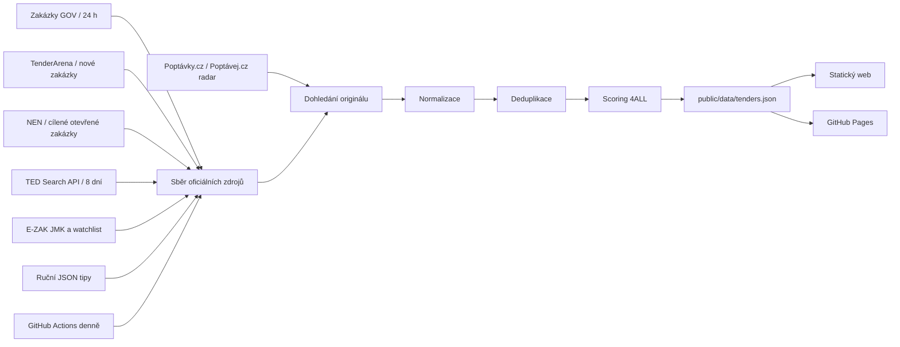

# Architektura a provoz

## Tok dat

## Provozní rozhodnutí

- **Bez databáze:** několik stovek otevřených tipů se bezpečně vejde do verzovaného JSON. Historie změn je přímo v Gitu a hosting nemá serverovou část.
- **Bez tajných klíčů:** hlavní zdroje jsou veřejné. První nasazení proto funguje bez správy secrets.
- **Překryv TEDu:** dotaz sahá osm dní zpět, aby krátký výpadek workflow nevytvořil mezeru. Deduplikace zabrání opakovanému publikování.
- **Český agregátor:** Zakázky GOV uvádí zakázky z různých systémů na jednom místě a poskytuje stručný popis, zadavatele, publikaci a lhůtu.
- **Fail-safe:** když selžou všechny oficiální síťové zdroje, agent skončí chybou a nepřepíše data prázdným souborem. Při výpadku jednotlivého zdroje použije ostatní a stav zapíše do `sources`.
- **Agregátory nejsou autorita:** Poptávky.cz a Poptávej.cz pouze vytvoří lead. Přímý oficiální odkaz nebo shoda s oficiálním záznamem jej povýší na ověřený původ; nejisté tipy zůstávají viditelně označené.

## Denní běh

Workflow běží v 04:20 UTC (v Praze podle sezóny 05:20 nebo 06:20). Pořadí:

1. čistá instalace a testy,
2. načtení zdrojů,
3. spojení s existující historií,
4. normalizace, deduplikace a přepočet relevance,
5. commit pouze při změně dat,
6. push spustí samostatné nasazení GitHub Pages.

Workflow lze kdykoli spustit ručně v záložce Actions. Díky `concurrency` se dva denní běhy nepřepisují.

## Deduplikace

První klíč je `source + sourceId`. Druhý, mezizdrojový klíč je SHA-256 fingerprint z normalizovaného názvu zadavatele, názvu zakázky a dne lhůty. Při sloučení se zachová delší popis, CPV z obou zdrojů, nejstarší `firstSeenAt` a seznam zdrojů.

## Budoucí rozšíření

- e-mailový nebo Slack digest jen pro skóre 75+,
- jednoduchá redakční vrstva (`nové / posoudit / go / no-go`),
- LLM druhý průchod nad zadávací dokumentací až po levném pravidlovém filtru,
- sběr z placeného zdroje přes nový adaptér v `src/sources/`,
- zpětná vazba z vyhraných/prohraných příležitostí pro kalibraci vah.
